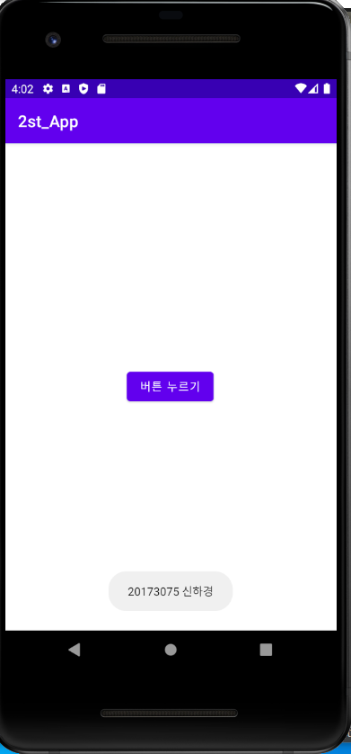
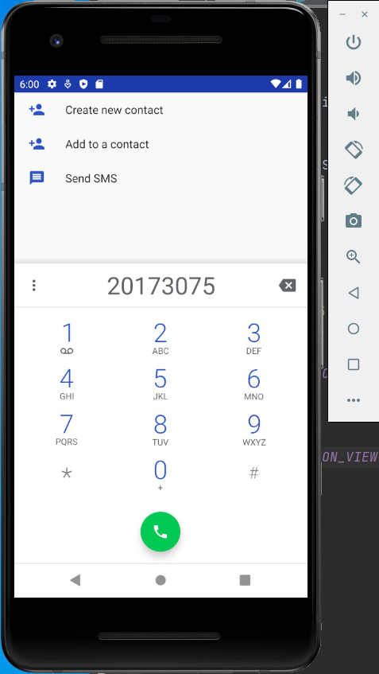
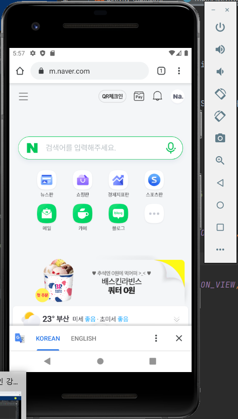

# 20173075 신하경

## 1주차

## 2주차
  - Github사용법
  - 안드로이드앱 프로그래밍 시작
    - Toast 시작
    - AVD 시작하기
     
     
</img>

</img>

## 3주차

</img>

</img>

## 4주차
  -간단한 얼굴형 분석/ 어울리는 스타일링 추천 앱
  -얼굴형 분석에 따른 어울리는 헤어스타일이나 스타일링에 대한 정보들은 계속 많아지고 있고 스스로
   분석하는 방법도 알려주고 있지만 자신을 분석해보기엔 긴가민가한 부분들이 많습니다.
   그래서 다른 사람에게 진단 받고 어울리는 스타일에 대해 추천을 받고 싶다는 생각이 들었고
   이런 앱이 있다면 많은 분들의 스타일링 고민이 해결될 것 입니다.
  
